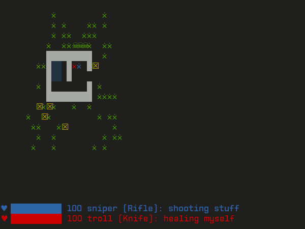

Zombsole
========

Zombsole is a game in which you play **programming** simple bots, which will have 
to survive and fight against hordes of zombies.

The game is **cooperative**: the idea is to find some friends, each one program a 
different bot, and then put the bots to work together against the zombies.

There are three different game types:

* **Extermination**: you must kill all zombies, and at least 1 player must survive.
* **Evacuation**: all players start far away from each other, and must get together
  to be evacuated at any place by an helicopter. At least half of the team must
  survive.
* **Safe House**: all players must travel and get inside a single safe house. At 
  least 1 player must reach it, but to win, all the living players must be 
  inside.

And the best of all: is really **simple**.

Getting started
===============

The game isn't packaged for PyPI or anything, it's meant to be a playground, so just
clone the code, install its dependencies, and get inside the ``zombsole`` folder to
start messing around:

.. code-block:: bash

    git clone https://github.com/fisadev/zombsole.git
    cd zombsole
    sudo pip install -r requirements.txt

(If you know about virtualenv, use it!)

And now lets just run a simple demo game:

.. code-block:: bash

    ./play.py extermination sniper,troll -n 50 -m to_the_closet

Depending on how lucky you are, this could either keep running forever, or quickly
end with a very un-gory massacre of the two players (sniper and troll). If you want
to stop the game, just press ``Ctrl-c``.

The parameters of the ``play.py`` script are very easy to understand, just run 
``./play.py --help``. In the example we just said "run an extermination game 
with the to_the_closet map, the players sniper and troll, and a constant population 
of 50 zombies."

The fun part: how to create your own players
============================================

To create a player you need to create a python module inside the ``players`` folder, 
with your player name as module name. For example ``players/terminator.py``.

Inside your player module, you have to define 2 things: a player class and a ``create`` 
function.

Your player class
-----------------

It should inherit ``things.Player``, and implement a single instance method called
``next_step``. Something like this:

.. code-block:: python

    from zombsole.things import Player

    class Terminator(Player):
        '''Liquid metal, invincible.'''
        def next_step(self, things, t):
            return 'heal', self

This ``next_step`` method will be called each game instant, so your player can think
and decide what to do next. The method receives ``things``, which is a dictionary of
all the things present in the world (the game world, that is. I can't know all the 
things in the real world, because it's too much time-consuming). In this dictionary,
the keys are the positions, and the values are the things in those positions.

Example of ``things`` you can receive:

.. code-block:: 

    {   
        (0, 0): <instance of Zombie>,
        (0, 1): <instance of Zombie>,
        (0, 2): <instance of Zombie>,
        (10, 1): <instance of Wall>,
        (10, 3): <instance of Wall>,
        (23, 25): <instance of Box>,
        (50, 34): <instance of another Player>,
        (51, 40): <you (self)>,
    }

The method also receives ``t``, which is an integer representing the "instant" of time, 
in case you want to use that information.

And as you can see, the result of ``next_step`` must be a tuple. This tuple has two parts:
the first one is the action to do, and the second one is the "target" for the action.
Actions can be:

+-----------+---------------------------------------------------------------------------+
| attack    | attack with your weapon, the target must be a ``Thing`` (yourself,        |
|           | another player, zombie, wall, box...)                                     |
+-----------+---------------------------------------------------------------------------+
| heal      | heal something, the target must be a ``Thing`` (yourself, another player, |
|           | zombie, wall, box...)                                                     |
+-----------+---------------------------------------------------------------------------+
| move      | move to another location, the target must be a position (a tuple of       |
|           | (x, y))                                                                   |
+-----------+---------------------------------------------------------------------------+

If your bot doesn't feel like doing anything useful, it could also return just None, and no
action will be performed. He will just stand still, watching as his fellow bots fight endless
hordes of zombies without his help.

Some extra notes about actions:

* Your weapon has a maximum range, visible at ``self.weapon.max_range``. If you try to shoot 
  things that are farther away, you won't hit them. And you can use the ``distance`` function
  from the ``utils`` module to calculate distances between points.
* Healing has a range too (visible at ``core.HEALING_RANGE``).
* Movement is limited to adjacent tiles. That is, you can only move 1 block either up, down,
  left or right. If you try to move to anywhere else, you will just stay still.

And also, there are other two attributes in your player that can be useful to look at:

* ``self.life``: amount of current life, from 0 (dead) to 100 (healthier than wolverine).
* ``self.position``: your current position on the map.
* ``self.rules``: the name of the rules of the game playing.
* ``self.objectives``: the objective positions of the game playing (can be None).

Your create function
--------------------

Besides your player class, you had to define a ``create`` function inside your player module.
This function must look like this:

.. code-block:: python

    def create(rules, objectives=None):
        return Terminator('terminator', 'blue', rules=rules, objectives=objectives)

The create function will be the one creating the instance of your player. You can run additional logic
here before game starts, and the parameters you receive will tell you the kind of game that will be
played (``rules`` is a string with the name of the rules of the game), and the objectives
locations if there are any in the current game rules (Safehouse game mode has objective locations
that players must reach. Extermination and Evacuation don't have objective locations).

The default parameters your ``Player`` instance will need when created are a friendly name ("terminator"
in the example) and a color (blue, cyan, green, grey, magenta, red, white, or yellow). You can also
specify the weapon you want to use, importing them from the ``weapons`` module. But don't abuse this,
try to keep it challenging (i.er, don't create an army full of shotguns, be humble, it's a zombie apocalypse,
not WW3).

And finally, your player receives the ``rules`` name and the ``objectives``, to store them and be able to use
that info later on the ``next_step``.

Collaborative for the win
-------------------------

Besides moving, playing doctor and smashing things, your players can communicate with each other! And in a
quite simple manner. You just have an instance attribute called ``status``, that you can update at any
moment from inside your ``next_step`` method. This status is visible to other players, so you can use
status messages to give orders, ask for help, insult players that aren't killing enough zombies, and 
many more.

You update your status doing something like this:

.. code-block:: python

    class Terminator(Player):
        '''Liquid metal, invincible.'''
        def next_step(self, things, t):
            self.status = u'Healing myself, because I am invincible'
            return 'heal', self

And you can see other player statuses with something like this:

.. code-block:: python

    class Terminator(Player):
        '''Liquid metal, invincible.'''
        def next_step(self, things, t):
            other_players = [thing for thing in things.values()
                             if isinstance(thing, Player)]
            for player in other_players:
                print player.name, 'status is:', player.status

            return 'heal', self

**That's it**. That's pretty much everything you need to know to create your own player. And if you want 
to see some inspirational examples, the ``players`` folder already has some simple ones, and even a 
player that can be controlled in real time by a human using the keyboard! (but still, Randoman is the 
best).

Breaking the game
=================

In a normal game play, your player instance has references to all the other things in the world.
This leaves a **giant** backdoor to hack, that allows you to do stuff like this:

* Put every ``zombie.life`` to 0, effectively killing all zombies with just your thought.
* Add 300 clones of you to the map (maybe you were some kind of replicant).
* Replace every zombie's ``next_step`` function with a custom made, and make them obey you.
* Increase your weapon range and damage.
* Teleport to any locations.
* etc..

If you want a real survival challenge, just don't modify anything in ``things``, and don't modify
your ``self.life`` or ``self.position`` (neither your weapon properties).

If you like a mind control challenge, use all that and create an army of coordinated zombies that
write your player's name in the map by moving boxes.

**Either way, the point is to have fun programming :)**

And finally, the game features an advanced isolation mechanism based on `Docker <http://docker.io>`_,
which you could use to effectively forbade any of those hacks in the scenario of some public competence
or if you are running "untrusted" code. This isn't documented yet, but it's functional and quite
simple. I promise to add docs in a few days.

Creating maps
=============

This is super easy: create a text file under the ``maps`` folder (name without spaces), and use 
these characters to draw objects and important locations:

+--------+--------------------------------------------------------------------------------------+
| ▓ or w | a wall                                                                               |
+--------+--------------------------------------------------------------------------------------+
| ☒ or b | a box                                                                                |
+--------+--------------------------------------------------------------------------------------+
| p      | a player spawn point (be sure to add at least 10)                                    |
+--------+--------------------------------------------------------------------------------------+
| z      | a zombie spawn point (be sure to add **many more**)                                  |
+--------+--------------------------------------------------------------------------------------+
| o      | an objective location (for safehouse games, be sure to add as many as player spawns) |
+--------+--------------------------------------------------------------------------------------+
